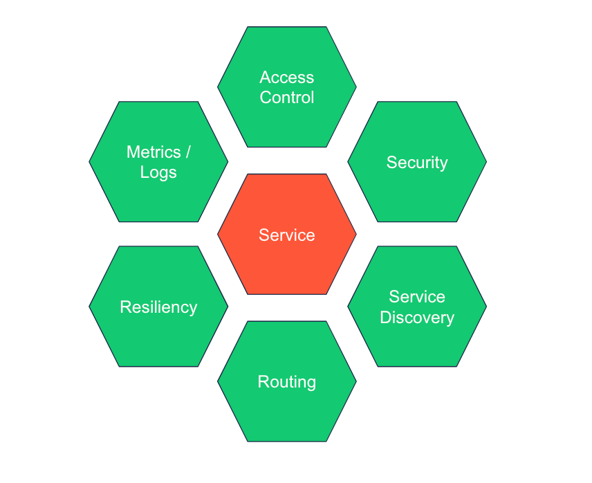
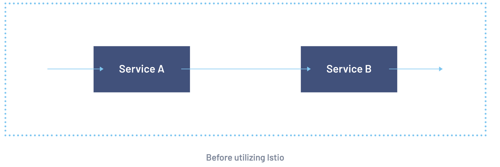
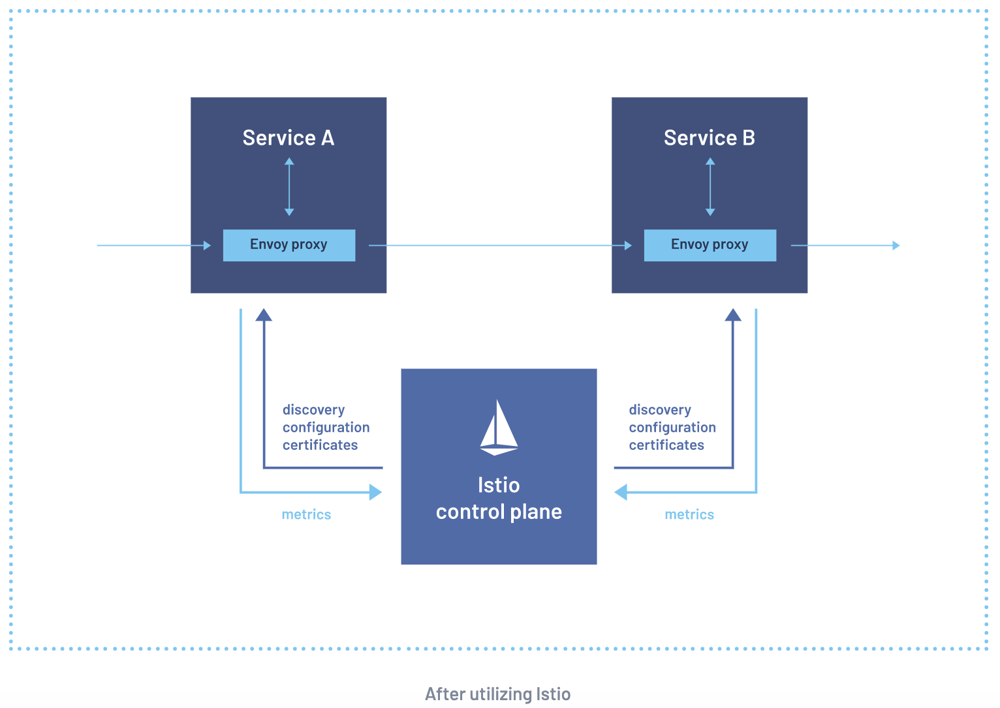
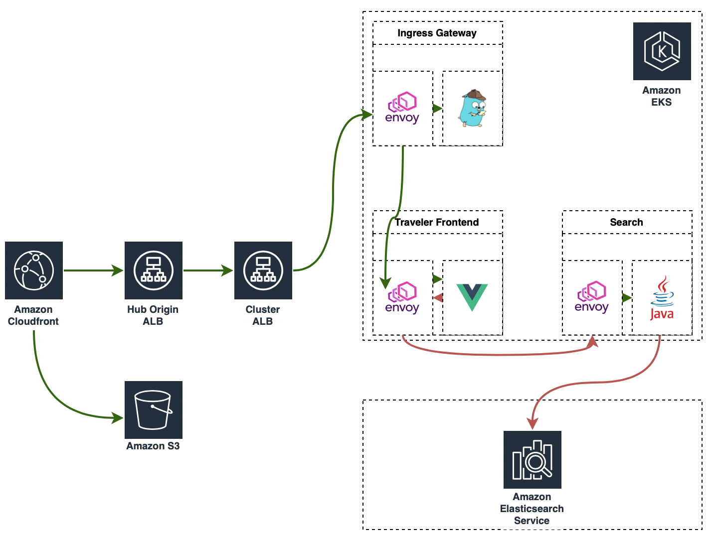

# Route Table Check Tool
INTRODUCTION
 
Modern management systems for container management takes care of a lot of heavy lifting when it comes to deploying and handling applications. They are often used together with a service mesh that takes care of additional areas like networking and security configuration. While these tools are great, they are also somewhat complex to set up and are higher in mantainence and mistakes in how they are configured and deployed can have severe security consequences.  
 
- Service Mesh: Modern applications are typically architected as distributed collections of microservices, with each collection of microservices performing some discrete business function.
A service mesh is a dedicated infrastructure layer that you can add to your applications. It allows you to transparently add capabilities like observability, traffic management, and security, without adding them to your own code. The term “service mesh” describes both the type of software you use to implement this pattern, and the security or network domain that is created when you use that software.
 


- ISTIO: Istio is an opensource service mesh that layers transparently onto existing distributed applications. 
Istio’s powerful features provide a uniform and more efficient way to secure, connect, and monitor services.
Istio is the path to load balancing, service-to-service authentication, and monitoring – with few or no service code changes. An Envoy proxy is deployed along with each service that you start in your cluster, or runs alongside services running on VMs. 

- Envoy: Envoy is an L7 proxy and communication bus designed for large modern service-oriented architectures. Envoy is a self-contained process that is designed to run alongside every application server.All of the Envoys form a transparent communication mesh in which each application sends and receives messages to and from localhost and is unaware of the network topology.
     
- Virtual Services: Virtual services, along with destination rules, are the key building blocks of Istio’s traffic routing functionality. A virtual service lets you configure how requests are routed to a service within an Istio service mesh, building on the basic connectivity and discovery provided by Istio and your platform.  Each virtual service consists of a set of routing rules that are evaluated in order, letting Istio match each given request to the virtual service to a specific real destination within the mesh. Your mesh can require multiple virtual services or none depending on your use case. 





It is our responsibility to manage how the traffic reaches the organization’s services, either from the internet, commonly known as north/south, or service to service, east/west. Since all the services of the organization runs on Kubernetes, and we have been using Istio for both network use cases, this brings the benefit of having the same networking configuration for ingress and service to service traffic. All the external routing configurations live in a single repository with more than 60 VirtualServices.

Hence, this project aims to implement a Route table check tool which checks if the route returned by a router matches what is expected. The tool can be used to check cluster name, virtual cluster name, virtual host name, manual path rewrite, manual host rewrite, path redirect, and header field matches. Envoy route table check tool reads Envoy route and its own test cases to assert routing. We would, therefore, translate VirtualServices into Envoy routes/ Istio config to envoy config to use the native route table check tool. This would allow much richer/lower maintenance test cases as we can cover all of Istio API surface.

# Life of a request: 
Different domains at GetYourGuide can reach the internal services through different paths but mostly go over CloudFront.The figure below illustrates the architecture of the system. It shows the workflow/routeflow of a request to www.getyourguide.com and the components making up the ecosystem.



  - Amazon CloudFront : There are many CloudFront Distributions as each domain or domain group has different needs for caching behaviours and other custom setup. By default, HTTP requests are redirected to HTTPS and TLS termination is done by CloudFront. For the customer website (eg: www.getyourguide.com), the static assets (images, css, etc) are stored in a Amazon S3 bucket which is served directly to clients (browsers/apps) offloading internal services.
   - Hub Origin ALB: In this layer it validates the authentication headers set by our CloudFront Distributions and the request is forwarded to the designated Production cluster.
   - Cluster NLB: Each EKS cluster is provisioned with a private Network Load Balancer. This is how all requests get into the cluster. Each listening port of the NLB goes to dedicated Target Groups. Requests to the marketplace website goes to the External Ingress Gateway deployment.
   - The External Ingress Gateway :  is our entrypoint inside Kubernetes for HTTP requests coming from the internet. Envoy running in these Pods contains the routing configuration defined in the [routes repo](https://github.com/getyourguide/routes) and forwards requests to the service matching the request parameters (eg.: Host, Path, Method, etc.).
     

# How it works

   - Step 1. It retrieves envoy route configuration rom a live Pod from an istio proxy. It leverages Istio CLI (istioctl) to facilitate gathering the route configuration.
   - Step 2. Dumps the Envoy route configuration in the same directory where the router check tool tests are.
   - Step 3. Cleans the incompatible bits of it. Istio does not use the upstream Envoy, instead they use a forked version with Istio specifics which they maintain. Not all features available in upstream Envoy is present. That's why we have to clean it up as the Envoy route table check tool is built using upstream Envoy. Example retry_host_predicate: used to reject a host based on predefined metadata match criteria. If any of the predicates reject the host, host selection will be reattempted.
   - Step 4. Runs the envoy router check tool against it in a docker container.

The route table check tool config is composed of an array of json test objects. Each test object is composed of three parts:

  1. Test name: This field specifies the name of each test object.
  2. Input values: The input value fields specify the parameters to be passed to the router. Input values are sent to the router that determine the returned route. Example input fields include the `:authority`, `:path`, and `:method` header fields. The `:authority` [The url authority. This value along with the path parameter define the url to be matched.] and `:path` [The url path. ] fields specify the url sent to the router and are required. All other input fields are optional.
  3. Validate: The validate fields specify the expected values and test cases to check. At least one test case is required.

# Usage

```shell
./route-check-tool
usage: main.py [-h] [--namespace NAMESPACE] [--deploy DEPLOY] --tests-dir TESTS_DIR [--offline]
```

   [--namespace]

   The namespace where the deployment with a istio proxy is running.

   [--deploy]

   The Kubernetes deployment name you want to retrive envoy route configuration to run the tests.

   [--tests_dir]

   The directory where the router check tool tests are. Note: The route configuration will be writen on the same dir.

   [--offline]

   Set it to true to skip dumping a new configuration from a Pod and sanitizing it.It will just run docker with the files already present in disk.
    
# Example: 
A simple tool configuration json has one test case and is written as follows. The test expects a cluster name match of “instant-server”.:

      tests
       test_name: Cluster_name_test
       input:
         authority: api.lyft.com
         path: /api/locations
       validate:
         cluster_name: instant-server

Given below is a sample of configuration: 

     tests
       test_name: ...
        input:
          authority: ...
          path: ...
          method: ...
          internal: ...
          random_value: ...
          ssl: ...
          runtime: ...
          additional_request_headers:
             - key: ...
               value: ...
          additional_response_headers:
              - key: ...
                value: ...
        validate:
           cluster_name: ...
           virtual_cluster_name: ...
           virtual_host_name: ...
           host_rewrite: ...
           path_rewrite: ...
           path_redirect: ...
           request_header_matches:
             - name: ...
               string_match:
                 exact: ...
           response_header_matches:
              - name: ...
                string_match:
                 exact: ...
              - name: ...
                presence_match: ...

 Have a look in the [Testcase References](https://www.envoyproxy.io/docs/envoy/latest/configuration/operations/tools/router_check#config-tools-router-check-tool) to learn more about how to define the tests.  

# Output

The program exits with status EXIT_FAILURE if any test case does not match the expected route parameter value.
If a test fails, details of the failed test cases are printed if --details flag is provided. The first field is the expected route parameter value. The second field is the actual route parameter value. The third field indicates the parameter that is compared. In the failed test cases, conflict details are printed. In the following example, Test_2 and Test_5 failed while the other tests passed. In the failed test cases, conflict details are printed.


      Test_1
      Test_2
      default other virtual_host_name
      Test_3
      Test_4
      Test_5
      locations ats cluster_name
      Test_6

Coverage

The router check tool will report route coverage at the end of a successful test run.This reporting can be leveraged to enforce a minimum coverage percentage by using the -f or --fail-under flag. If coverage falls below this percentage the test run will fail.By default the coverage report measures test coverage by checking that at least one field is verified for every route. However, this can leave holes in the tests where fields aren’t validated and later changed. For more comprehensive coverage you can add a flag, `--covall`, which will calculate coverage taking into account all of the possible fields that could be tested.

     Current route coverage: 6.2948%
     Failed to meet coverage requirement: 7%


# Building Envoy Router Check Tool

Envoy route table check tool is not released by the Envoy team and we only have the source code. Therefore, we build the tool and make it usable via container.
The tool can be built using docker:

```shell
docker build . -f v1.21.0/Dockerfile -t router-check-tool
```
# Challenges and Future work
  CHALLENGES:

1.First issue
```
Unable to parse JSON as proto (INVALID_ARGUMENT:(virtual_hosts[49].routes[17].typed_per_filter_config[0].value): invalid value Invalid type URL, unknown type: envoy.extensions.filters.http.fault.v3.HTTPFault for type Any): {
```
```json
"typedPerFilterConfig": {
    "envoy.filters.http.fault": {
      "@type": "type.googleapis.com/envoy.extensions.filters.http.fault.v3.HTTPFault",
      "abort": {
        "httpStatus": 410,
        "percentage": {
          "numerator": 1000000,
          "denominator": "MILLION"
        }
      }
    }
```
2. Second issue: Large regex
```
regex '(^(\/[a-zA-Z]{2}(-[a-zA-Z]{2})?)?\/?activity\/([^\/]+)?-l(\d+)\/([^\/]+)?-t(\d+)\/?$)|(^(\/[a-zA-Z]{2}(-[a-zA-Z]{2})?)?\/?([^\/]+)?-l(\d+)\/([^\/]+)?-t(\d+)\/?$)|(^(\/[a-zA-Z]{2}(-[a-zA-Z]{2})?)?\/?activity\/([^\/]+)?-t(\d+)\/?$)|(^(\/[a-zA-Z]{2}(-[a-zA-Z]{2})?)?\/?([^\/]+)?-t(\d+)(\/.*)?$)' RE2 program size of 222 > max program size of 100 set for the error level threshold. Increase configured max program size if necessary.
```
3. Third issue: Predicates
```
Didn't find a registered implementation for name: 'envoy.retry_host_predicates.previous_hosts
```
  To resolve this, we have manually edited the test.py file to remove retry_host_predicate.

 FUTURE WORK:

 Future research would examine strategically on how to tackle and resolve the remaining two issues mentioned in challenges.

# Authors
[Shirin Bellary](https://github.com/ShirinBellary) (with [Fernando Cainelli](https://github.com/cainelli) as Supervisor)

# Version History
Envoy [1.21.0 (January 12, 2020)](https://www.envoyproxy.io/docs/envoy/latest/version_history/v1.21.0)

# References
  - [GetYouGuide documentation](https://docs.gygadmin.com/computing/life-of-a-request)
  - [The Istio service mesh](https://istio.io/latest/about/service-mesh/)
  - [Preventing traffic routing regressions for Istio virtual services](https://inside.getyourguide.com/blog/2020/10/30/preventing-traffic-routing-regressions-for-istio-virtual-services)
 
# Security
For sensitive security matters please contact security@getyourguide.com 
